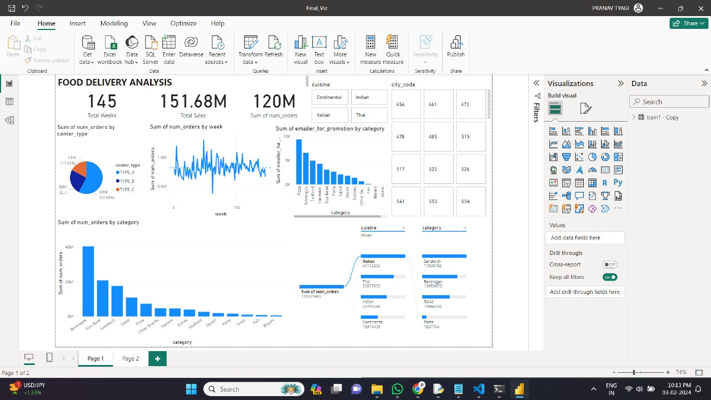

# PowerBI - Visualisation

Visualisation is a key part in MLOPS and thus for our Food Demand Prediction project, one of the tools we have used is PowerBI.

We have tried to make a clear visualisation of the dataset to understand the trends and patterns in the data, to clearly understand what we are working on.

## Dashboard Snapshot:

## stream_data.py:

We have designed this script to read data from a CSV file in chunks and send it to a Power BI API endpoint in batches.

### Usage

The script reads data from a CSV file specified in the `csv_file_path` variable. It keeps track of the last processed row in a text file specified in the `last_row_file` variable. 

The Power BI API endpoint is specified in the `url` variable. 

The user is prompted to enter the number of batches to send, which is stored in the `num_batches` variable. Each batch contains 10,000 rows, as specified in the `batch_size` variable.

The script reads the CSV file in chunks, starting from the last processed row. Each chunk is sent to the Power BI API endpoint as a list of dictionaries, where each dictionary represents a row of data.
